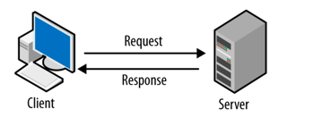

# video_streamer

### In this project design/implement client-server apps in python contain three main points

- sockets
- multithreading
- JSON formatted messages

### **Client-Server**

### **Project - video streamer**

- server can share video from file or live video
- server listen to client if would connect, if client connect server send message to client contain details about video
- three client as max to connect of server
